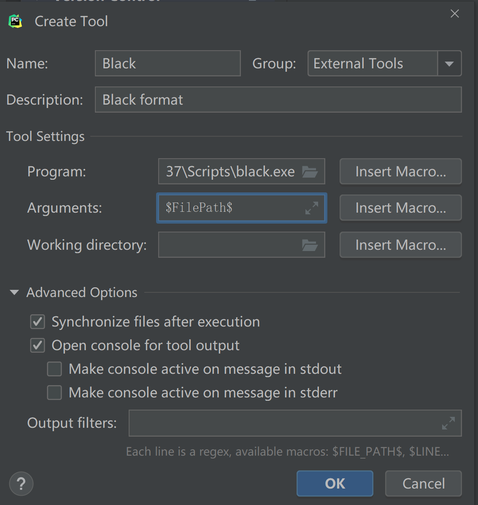

## Black

### Install

```bash
pip install black
```

### Configure

* **pyproject.toml**

  ```toml
  [tool.black]
  skip-string-normalization = true  # 禁用双引号风格
  ```

* **pycharm**

  * Create external tools

     > windows: File -> Settings -> Tools -> External Tools
  
     
  
  * Configure file watcher
  
     
